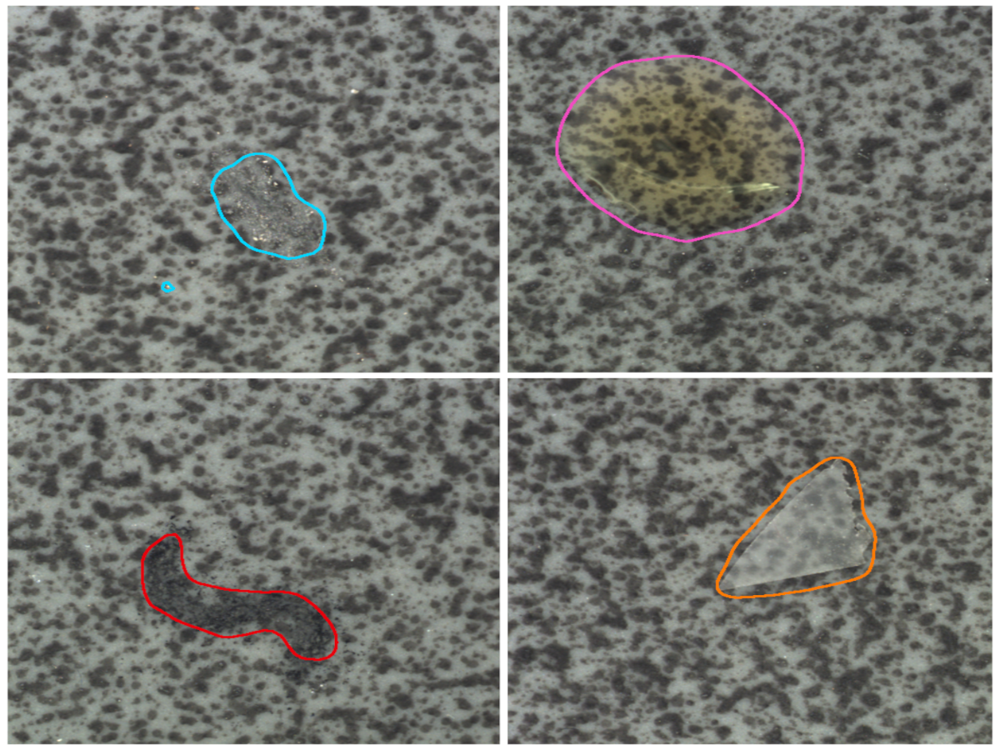

# Blind Localization and Clustering of Anomalies in Textures (CVPRW 2024)

### [Project Page](https://reality.tf.fau.de/pub/ardelean2024blind.html) | [Paper](https://arxiv.org/pdf/2404.12246.pdf)

The official implementation of *Blind Localization and Clustering of Anomalies in Textures*.
Accepted in the Visual Anomaly and Novelty Detection workshop - 2nd Edition, from CVPR 2024.



## Installation
We implemented our method using PyTorch. 
For an easy installation, we provide an environment file that contains all dependencies:

```
conda env create -f environment.yml
conda activate blindLCA
```


## Data
Our code is prepared to work with the MVTec dataset. To reproduce the experiments for the Leaves and MTD datasets, please organize the data to follow the same format. 
You can download the MVTec AD from [here](https://www.mvtec.com/company/research/datasets/mvtec-ad); the Coffee Leaves dataset (Leaves) can be downloaded [here](https://drive.google.com/open?id=15YHebAGrx1Vhv8-naave-R5o3Uo70jsm); and the MTD dataset can be found [here](https://github.com/abin24/Magnetic-tile-defect-datasets.).
Please extract the data into the `datasets` directory.
To use any other dataset that follows the MVTec file structure you can simply place the data in the `datasets` folder and create a corresponding dataset config file under `conf/dataset`. To understand the required format, please see `conf/dataset/mvtec.yaml`.

## Run and evaluate on a dataset
Before running our full method for blind anomaly detection, one must train the Variational Autoencoder (VAE). The `compute_residuals.py` script trains the VAE and then saves the residual maps in the `cache` directory to simplify the processing later. Please run the script for each desired dataset:
```
python compute_residuals.py --dataset mvtec
```
After computing the residual maps, our algorithm can be run through the `main.py` script. We use Hydra to manage the command line interface, which makes it easy to specify the method and dataset configurations.
For example, running our blind anomaly localization and clustering method on the MVTec dataset is done using:
```
python main.py dataset=mvtec method=ours feature_provider=vae
```
To run the same on the Leaves dataset:
```
python main.py dataset=leaves method=ours feature_provider=vae
```

The predicted anomaly maps, the image-to-cluster assignments, and metrics are saved in the following directory: `outputs/{experiment_name}`. The experiment name is automatically generated.


## Ablations
This repository also makes it easy to run several ablations. We include different methods for processing the features to obtain the anomaly maps and allow running our code with and without contrastive learning.
To run a certain ablation use the corresponding `method` from the configurations: 
* Plain FCA applied to WideResnet-50 features, without contrastive learning:
```
python main.py dataset=mvtec method=just_fca
```
* Using the VAE-based residual maps but no contrastive learning:
```
python main.py dataset=mvtec method=residuals_fca feature_provider=vae
```
* FCA applied to WideResnet-50 features with contrastive learning
```
python main.py dataset=mvtec method=ours feature_provider=wide method.scale_features=True
```
* Residual map features and contrastive learning (our full method)
```
python main.py dataset=mvtec method=ours feature_provider=vae
```
If your GPU does not have enough memory to hold the entire dataset, you can use the option `feature_provider.save_in_memory=False`.

## Citation
Should you find our work useful in your research, please cite:
```BibTeX
@inproceedings{ardelean2024blind,
    title = {Blind Localization and Clustering of Anomalies in Textures},
    author = {Ardelean, Andrei-Timotei and Weyrich, Tim},
    booktitle = {Proceedings of the IEEE/CVF Conference on Computer Vision and Pattern Recognition Workshops (to appear)},
    year = {2024},
    month = jun,
    day = 17,
    authorurl = {https://reality.tf.fau.de/pub/ardelean2024blind.html},
}
```

## Acknowledgements
This project has received funding from the European Union’s Horizon 2020 research and innovation programme under the Marie Skłodowska-Curie grant agreement No 956585.

## License
The code is released under the CC BY 4.0 [LICENSE](LICENSE).